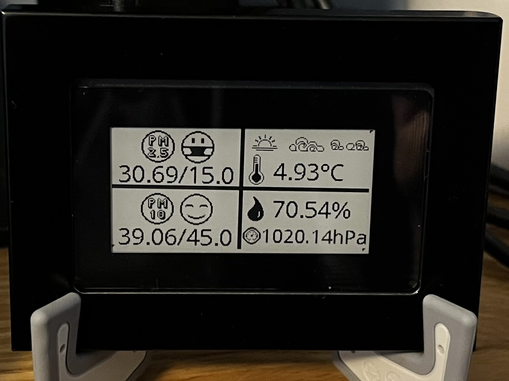

# Weather Conditions Display with Waveshare 2,13inch e-Paper HAT screen



This Python script fetches weather conditions from specified sources and displays them on a Waveshare 2.13inch Touch e-Paper HAT screen along with additional images. It supports fetching data from Airly, and AQICN APIs.

## Prerequisites

```
Python 3.x installed on your system
Waveshare 2.13inch Touch e-Paper HAT screen
Environment variables set up for API tokens (AQICN_TOKEN and AIRLY_TOKEN)
requests, pandas, dotenv, and PIL Python packages installed
Geographic locations and station IDs defined in a JSON file (default: data.json)
```

## Installation

Clone this repository or download the script.
Install required Python packages using pip3 install -r requirements.txt.
Usage

```
python3 weather_display.py [--datafile DATAFILE] [--rotate] [--city CITY] [--location LOCATION]
--datafile: Path to the JSON file containing geographic locations and station IDs. Default is data.json.
--rotate: Rotate the image by 180 degrees (optional).
--city: Specify the city for weather conditions.
--location: Specify the location ID for the chosen station.
```

## Example

```
python weather_display.py --rotate --city warsaw --location warsaw_station
```

This command will display weather conditions for Warsaw, Poland, using the station with ID warsaw_station and rotate the output image.

For usage run:

```
python weather_display.py --help
```

## Notes

Make sure to set up the required environment variables for API tokens.
Ensure the specified city and location ID are available in the provided data file.
Module `waveshare_epd` origin can be found here: https://github.com/waveshare/Touch_e-Paper_HAT.
Display manual can be found here: https://www.waveshare.com/wiki/2.13inch_Touch_e-Paper_HAT_Manual#Download_the_Demo

## Author

This script was created by Piotr Boruszczak.
